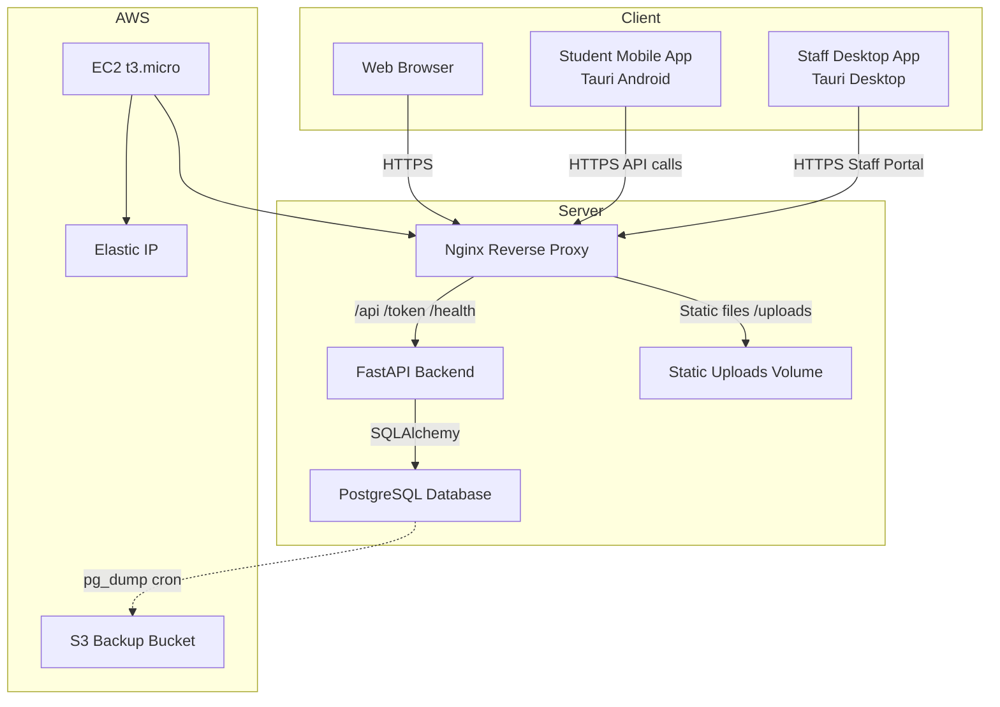
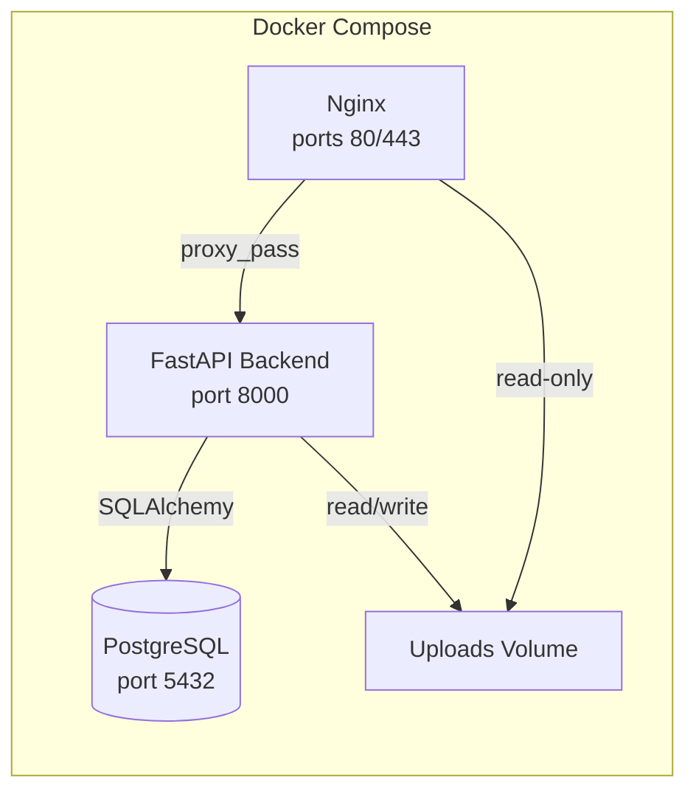
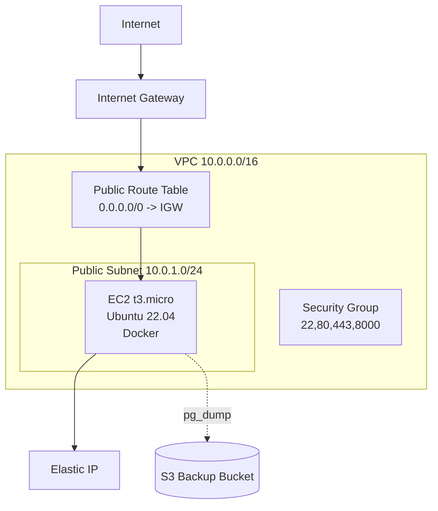
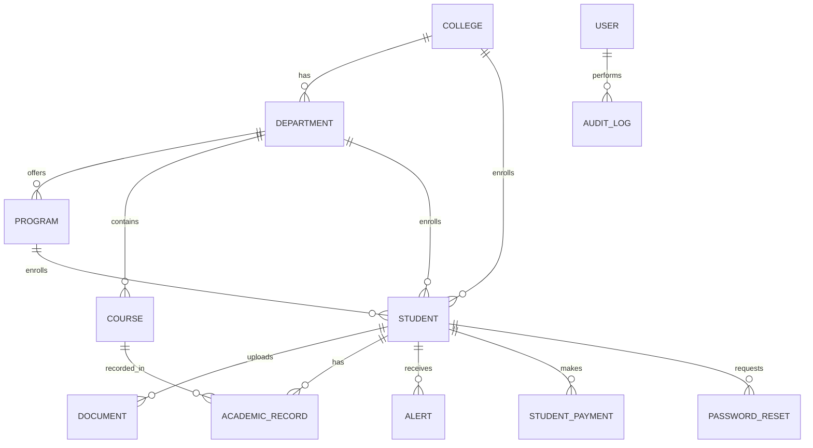
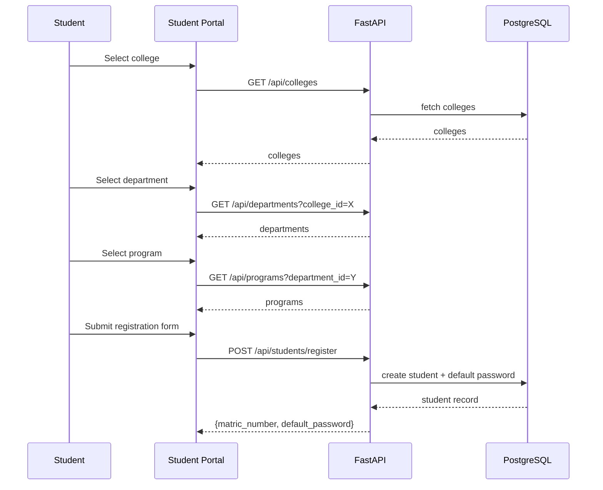
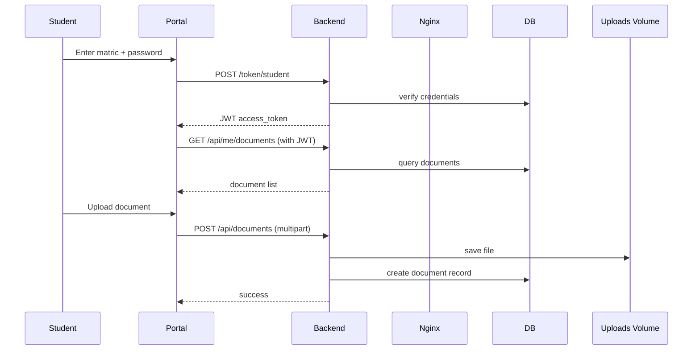
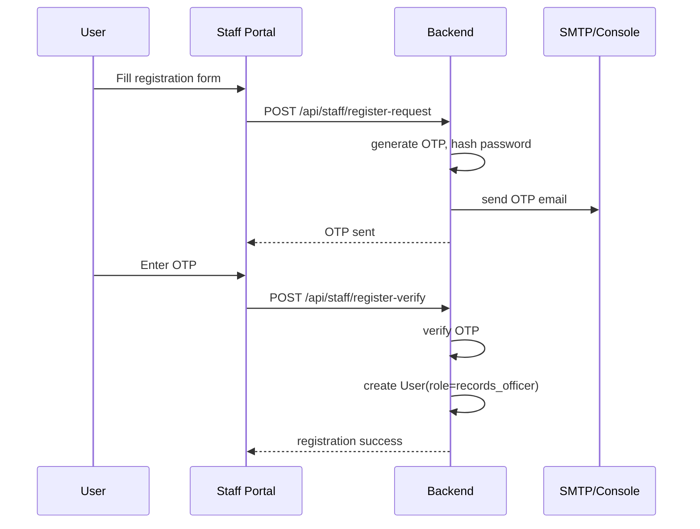
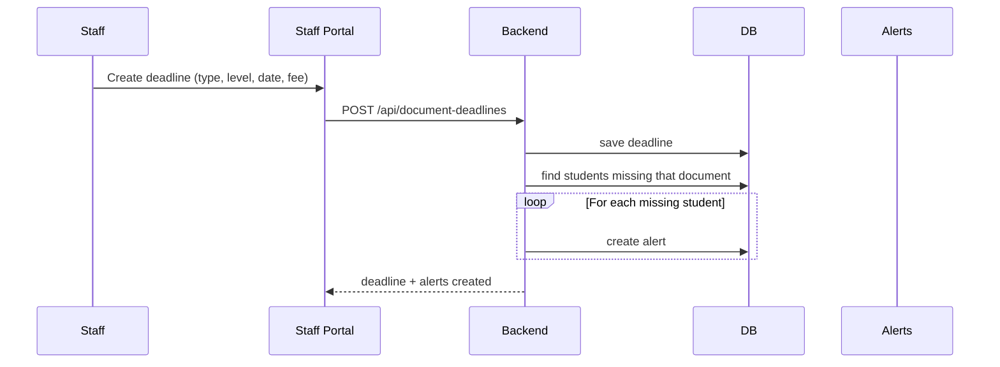

# Caleb University Records Management System (CU-Records)

A complete, production-ready records management platform for Caleb University. It provides a unified backend, separate web portals for students and staff, plus cross-platform desktop and mobile applications.

[](https://fastapi.tiangolo.com/)
[](https://react.dev/)
[](https://tauri.app/)
[](https://www.postgresql.org/)
[](https://www.terraform.io/)
[](https://www.ansible.com/)

---

## Table of Contents

- [Overview](#overview)
- [Key Features](#key-features)
- [Technology Stack](#technology-stack)
- [System Architecture](#system-architecture)
- [Security](#security)
- [Infrastructure](#infrastructure)
- [Database Schema](#database-schema)
- [Application Components](#application-components)
- [Workflows](#workflows)
- [API Overview](#api-overview)
- [Deployment](#deployment)
- [Environment Variables](#environment-variables)
- [Development Setup](#development-setup)
- [Testing](#testing)
- [Production Checklist](#production-checklist)
- [License](#license)

---

## Overview

CU-Records digitizes the student records lifecycle at Caleb University. It allows:

- **Students** to register, log in, upload required documents, view deadlines, receive alerts, and track academic progress.
- **Staff** to search students, manage documents, set deadlines, record grades, process payments, and register new staff accounts via OTP-verified email.
- **Administrators** to oversee users, audit actions, and configure reference data (colleges, departments, programs, courses).

The system is designed to run on a single VPS or AWS Free Tier instance using Docker, with infrastructure automated via Terraform and Ansible.

---

## Key Features

- **Dual Portal System** — separate, branded React apps for students and staff.
- **JWT Authentication** — role-based access control with separate staff and student token flows.
- **Document Management** — upload, download, deadline tracking, and late-fee enforcement.
- **Auto-Alerts** — automatic notifications when required documents are missing or deadlines approach.
- **OTP-Based Staff Registration** — public staff signup with email OTP verification.
- **Academic Records** — record and view grades per course/session/semester.
- **Payments** — track student payments with references.
- **Audit Logging** — every create/update/delete action is logged with user and timestamp.
- **Rate Limiting** — public endpoints are protected by per-IP rate limits via `slowapi`.
- **Dark Mode** — both portals support a persistent dark theme.
- **Cross-Platform Apps** — Tauri-powered desktop launcher and Android mobile app.
- **Infrastructure as Code** — Terraform + Ansible for repeatable AWS deployments.

---

## Technology Stack

| Layer | Technology |
|-------|------------|
| **Backend** | Python 3.12, FastAPI, SQLAlchemy 2.x, Pydantic |
| **Database** | PostgreSQL 16 (production), SQLite (local dev fallback) |
| **Frontend** | React 18, Vite 5, React Router 6 |
| **Desktop** | Tauri v2, Rust, WebKit/WebView2 |
| **Mobile** | Tauri v2 for Android (built from `frontend/`) |
| **Proxy** | Nginx (SSL termination, static files, API routing) |
| **Containerization** | Docker, Docker Compose |
| **IaC / Automation** | Terraform, Ansible |
| **Cloud** | AWS EC2, Elastic IP, S3, VPC, Security Groups |

---

## System Architecture

### High-Level Architecture



### Request Flow

1. User opens `https://culrecords.duckdns.org/` (student) or `/staff/` (staff).
2. Nginx serves the built React app or proxies API calls to the FastAPI backend.
3. FastAPI validates JWT tokens, queries PostgreSQL via SQLAlchemy, and returns JSON.
4. File uploads are stored in a Docker volume shared with Nginx for direct serving.
5. A nightly cron job dumps the database to the S3 backup bucket.

### Container Layout



---

## Security

CU-Records implements defense in depth across authentication, transport, and infrastructure layers.

### Authentication & Authorization

- **JWT Tokens**: Short-lived access tokens signed with `HS256` and a configurable `SECRET_KEY`.
- **Role-Based Access Control (RBAC)**:
  - `admin` — full access
  - `records_officer` — manage students, documents, grades, payments
  - `hod` — head of department access
  - `student` — self-service only
- **Password Hashing**: Staff passwords are hashed with `passlib[bcrypt]`.
- **Student Passwords**: Auto-generated as `Caleb{YY}` where `YY` is the admission year.
- **OTP Staff Registration**: New staff accounts require a one-time code sent to a valid university email.
- **Token Validation**: Separate dependencies `get_current_user` (staff) and `get_current_user_or_student` (mixed).

### Transport & Application Security

- **HTTPS Only**: Nginx redirects HTTP to HTTPS and serves HSTS headers.
- **Let's Encrypt**: SSL certificates obtained via Certbot and auto-renewed.
- **CORS**: Strict origin whitelist configured via `CORS_ORIGINS`.
- **Security Headers**: X-Content-Type-Options, X-Frame-Options, XSS-Protection, HSTS, Referrer-Policy.
- **Rate Limiting**: Public endpoints (`/api/students/register`, login, OTP) are rate-limited with `slowapi`.
- **Input Validation**: All request bodies are validated with Pydantic models.
- **SQL Injection Prevention**: SQLAlchemy ORM used exclusively; no raw SQL concatenation.

### Infrastructure Security

- **Security Groups**: Only ports 22 (SSH), 80 (HTTP), and 443 (HTTPS) are exposed publicly. Port 8000 is optional and can be disabled.
- **SSH Key Pairs**: Passwordless SSH with a dedicated deployer key.
- **Database**: PostgreSQL runs inside Docker with no public port exposed.
- **Secrets**: Managed via Ansible `group_vars/all.yml` and Docker `.env`, never committed to Git.
- **Backups**: Encrypted S3 bucket with versioning for database dumps.

### Audit & Compliance

- **Audit Logs**: Every mutation is logged to the `audit_logs` table with actor, action, table, record ID, and JSON details.
- **File Storage**: Uploaded documents are renamed to UUIDs and stored outside the web root, served read-only via Nginx.

### Known Hardening Recommendations

- Move JWT storage from `localStorage` to `httpOnly` cookies with CSRF protection.
- Migrate file storage to S3 with signed URLs.
- Implement refresh tokens and shorter access-token TTLs.
- Enable MFA for staff accounts.
- Add centralized log shipping (CloudWatch, Datadog, etc.).

---

## Infrastructure

### AWS Architecture (Terraform)



### Resources Created

| Resource | Purpose |
|----------|---------|
| `aws_vpc.main` | Isolated network for the application |
| `aws_subnet.public` | Public subnet with auto-assigned public IPs |
| `aws_internet_gateway.main` | Internet access for the subnet |
| `aws_route_table.public` | Routes public traffic to the IGW |
| `aws_security_group.app` | Firewall rules for 22, 80, 443, 8000 |
| `aws_instance.app` | t3.micro Ubuntu 22.04 server |
| `aws_eip.app` | Static public IP |
| `aws_s3_bucket.backups` | Versioned backup storage |
| `aws_key_pair.deployer` | SSH key pair for Ansible |

### Deployment Automation (Ansible)

The Ansible playbook (`infrastructure/ansible/playbook.yml`):

1. Updates packages and installs Docker, Docker Compose, Certbot, and Git.
2. Creates a 2 GB swap file for low-memory builds.
3. Clones the application repository.
4. Generates `.env` from the Jinja2 template.
5. Deploys containers with `docker compose`.
6. Creates database tables.
7. Obtains SSL certificate via Certbot webroot.
8. Generates production Nginx config and restarts the proxy.
9. Configures daily database backups.

See [`infrastructure/README.md`](infrastructure/README.md) for step-by-step AWS deployment.

---

## Database Schema

CU-Records uses SQLAlchemy ORM with PostgreSQL in production. Below is the entity relationship overview.

### Entity Relationship Diagram



### Core Tables

| Table | Description |
|-------|-------------|
| `colleges` | University colleges (e.g., College of Pure and Applied Sciences) |
| `departments` | Academic departments under each college |
| `programs` | Degree programs under each department |
| `courses` | Individual courses with credit units, level, and semester |
| `students` | Student profiles, credentials, and enrollment info |
| `documents` | Uploaded files per student (type, filename, path, size) |
| `academic_records` | Grades per student/course/session/semester |
| `users` | Staff/admin accounts with roles |
| `staff_registrations` | Pending staff registrations with OTP |
| `audit_logs` | Immutable audit trail of all mutations |
| `password_resets` | Token-based student password reset requests |
| `alerts` | System alerts shown to students |
| `document_deadlines` | Deadlines and late fees per document type/level |
| `student_payments` | Payment records per student |

### Indexes

Strategic indexes are placed on frequently queried columns:

- `students.matric_number`, `students.email`, `students.status`
- `documents.student_id`, `documents.document_type`, `documents.level`
- `academic_records.student_id`, `academic_records.grade`
- `alerts.student_id`, `alerts.is_read`
- `audit_logs.username`, `audit_logs.action`, `audit_logs.created_at`

---

## Application Components

### Backend (`backend/`)

The backend is a monolithic FastAPI application in `backend/main.py`.

#### Structure

```
backend/
├── main.py              # Application entry point, models, routes, auth
├── requirements.txt     # Python dependencies
├── Dockerfile           # Production container image
└── alembic/             # Database migration directory (reserved)
```

#### Key Modules

| Concern | Implementation |
|---------|----------------|
| **Models** | SQLAlchemy declarative models (`College`, `Student`, `Document`, `User`, etc.) |
| **Schemas** | Pydantic models for request/response validation |
| **Authentication** | `python-jose` + `passlib[bcrypt]` + custom `OAuth2PasswordBearer` variants |
| **Database** | SQLAlchemy engine with connection pooling; PostgreSQL or SQLite |
| **File Uploads** | `python-multipart`; files stored in `uploads/` volume |
| **Rate Limiting** | `slowapi` limiter on public endpoints |
| **Seed Data** | `_seed_reference_data()` and `_seed_default_user()` run on startup |
| **Audit** | `audit_action()` helper logs every mutation |

#### Main Route Groups

- **Authentication**: `/token`, `/token/student`, password reset
- **Public**: `/api/students/register`, `/health`
- **Students**: `/api/me/*`, `/api/students/*`, `/api/documents`, `/api/alerts`
- **Staff**: `/api/users/*`, `/api/search`, `/api/grades`, `/api/payments`, `/api/audit-logs`
- **Staff Registration**: `/api/staff/register-request`, `/api/staff/register-verify`
- **Stats & Reports**: `/api/dashboard-stats`, `/api/missing-documents`, `/api/document-deadlines`

### Student Portal (`frontend/`)

React 18 + Vite single-page application for students.

#### Pages

| Route | Purpose |
|-------|---------|
| `/` | Student login |
| `/register` | Self-registration with cascading college → department → program |
| `/dashboard` | Documents, deadlines, alerts, profile |
| `/settings` | Change password, dark mode toggle |

#### Key Files

```
frontend/src/
├── services/api.js      # API client with JWT interceptor
├── context/AuthContext.jsx
├── pages/
│   ├── Login.jsx
│   ├── Register.jsx
│   ├── StudentDashboard.jsx
│   └── Settings.jsx
└── index.css            # Caleb brand colors + dark mode
```

The mobile Android app is built from this same source via Tauri.

### Staff Portal (`frontend-staff/`)

React 18 + Vite single-page application for staff and administrators.

#### Pages

| Route | Purpose |
|-------|---------|
| `/` | Staff login |
| `/register` | Public OTP-verified staff registration |
| `/staff/dashboard` | Live dashboard stats |
| `/staff/search` | Live student search with dropdown |
| `/staff/register` | Single or bulk (CSV/Excel) student registration |
| `/staff/upload` | Bulk document upload |
| `/staff/missing-docs` | Missing documents report |
| `/staff/deadlines` | Document deadline management |
| `/staff/grades` | Grade recording |
| `/staff/payments` | Payment tracking |
| `/staff/users` | Staff user management |
| `/staff/audit` | Audit log viewer |

#### Key Files

```
frontend-staff/src/
├── services/api.js
├── pages/
│   ├── Login.jsx
│   ├── StaffRegister.jsx
│   ├── StaffDashboard.jsx
│   ├── StudentSearch.jsx
│   └── ...
└── components/
    ├── Navbar.jsx
    └── StudentSearch.jsx
```

### Desktop App (`desktop/`)

Tauri v2 desktop launcher built in Rust + Web frontend.

#### Features

- Branded launcher window showing server status.
- Opens the Staff Portal in a secure external Tauri window.
- Connects to the production API at `https://culrecords.duckdns.org`.

#### Structure

```
desktop/
├── src/
│   ├── index.html       # Launcher UI
│   ├── main.js          # Status polling
│   └── styles.css
├── src-tauri/
│   ├── src/lib.rs       # Rust commands and window management
│   └── capabilities/default.json
└── package.json
```

### Mobile App (`frontend/src-tauri/`)

The student portal is also wrapped as a Tauri v2 Android application.

#### Build

Built automatically via GitHub Actions (`.github/workflows/build-mobile.yml`):

1. Installs Node, Java, Android SDK, NDK, and Rust targets.
2. Initializes the Android project.
3. Replaces launcher icons with the Caleb logo.
4. Builds a universal debug APK.

The mobile app uses `VITE_API_URL=https://culrecords.duckdns.org` at build time so all API calls hit the production backend.

---

## Workflows

### Student Self-Registration



### Student Login & Document Upload



### Staff Registration via OTP



### Document Deadline & Alert Generation



---

## API Overview

The backend exposes a RESTful JSON API. All staff endpoints require a JWT bearer token in the `Authorization` header. Student endpoints accept either staff or student tokens where noted.

### Authentication Endpoints

| Method | Endpoint | Description |
|--------|----------|-------------|
| `POST` | `/token` | Staff login (email + password) |
| `POST` | `/token/student` | Student login (matric + password) |
| `POST` | `/api/password-reset/request` | Request student password reset |
| `POST` | `/api/password-reset/confirm` | Confirm reset with token |
| `POST` | `/api/staff/register-request` | Request OTP for staff registration |
| `POST` | `/api/staff/register-verify` | Verify OTP and create staff account |

### Student Endpoints

| Method | Endpoint | Description |
|--------|----------|-------------|
| `POST` | `/api/students/register` | Public self-registration |
| `GET`  | `/api/students/me` | Current student profile |
| `GET`  | `/api/me/documents` | My documents |
| `POST` | `/api/documents` | Upload a document |
| `GET`  | `/api/documents/{id}/download` | Download a document |
| `GET`  | `/api/document-deadlines` | List deadlines (staff or student) |
| `GET`  | `/api/alerts` | My alerts |
| `PATCH`| `/api/alerts/{id}/read` | Mark alert read |
| `GET`  | `/api/me/grades` | My academic records |
| `GET`  | `/api/me/payments` | My payments |

### Staff Endpoints

| Method | Endpoint | Description |
|--------|----------|-------------|
| `GET`  | `/api/dashboard-stats` | Live dashboard statistics |
| `GET`  | `/api/search` | Live student search |
| `GET`  | `/api/students/{id}` | Student details |
| `POST` | `/api/students` | Create single student |
| `POST` | `/api/students/bulk` | Bulk create from CSV/Excel |
| `POST` | `/api/grades` | Record grade |
| `POST` | `/api/payments` | Record payment |
| `POST` | `/api/document-deadlines` | Create deadline |
| `GET`  | `/api/missing-documents` | Missing documents report |
| `GET`  | `/api/audit-logs` | Audit trail |
| `GET`  | `/api/users` | List staff users |
| `POST` | `/api/users` | Create staff user |

### Health Check

| Method | Endpoint | Response |
|--------|----------|----------|
| `GET`  | `/health` | `{"status":"ok","timestamp":"..."}` |

For the full list of endpoints, run the backend locally and visit `/docs` for the interactive Swagger UI.

---

## Deployment

### Option 1: Local Development (No Docker)

#### Backend

```bash
cd backend
python -m venv venv
source venv/bin/activate
pip install -r requirements.txt
python -m uvicorn main:app --host 0.0.0.0 --port 8000 --reload
```

Visit `http://localhost:8000/docs` for Swagger UI.

#### Student Portal

```bash
cd frontend
npm install
npm run dev        # http://localhost:5173
```

#### Staff Portal

```bash
cd frontend-staff
npm install
npm run dev        # http://localhost:5174
```

#### Desktop App

```bash
cd desktop
npm install
npm run tauri dev
```

### Option 2: Docker Compose (Local/Production)

```bash
cp .env.example .env
# Edit .env with production values
docker compose up -d --build
```

This starts PostgreSQL, FastAPI, and Nginx. Tables and seed data are created automatically on startup.

### Option 3: AWS Free Tier (Terraform + Ansible)

See [`infrastructure/README.md`](infrastructure/README.md) for the complete guide.

High-level steps:

```bash
cd infrastructure/terraform
cp terraform.tfvars.example terraform.tfvars
# Edit terraform.tfvars
terraform init
terraform apply

cd ../ansible
cp group_vars/all.yml.example group_vars/all.yml
# Edit group_vars/all.yml
ansible-playbook -i inventory.ini playbook.yml
```

---

## Environment Variables

### Backend / Production `.env`

| Variable | Description | Example |
|----------|-------------|---------|
| `DB_USER` | PostgreSQL username | `calebrecords` |
| `DB_PASSWORD` | PostgreSQL password | *(strong random)* |
| `DB_NAME` | PostgreSQL database name | `calebrecords` |
| `DATABASE_URL` | Full SQLAlchemy connection string | `postgresql://...` |
| `SECRET_KEY` | JWT signing secret | `openssl rand -hex 32` |
| `CORS_ORIGINS` | Comma-separated allowed origins | `https://culrecords.duckdns.org` |
| `FRONTEND_URL` | Public frontend URL | `https://culrecords.duckdns.org` |
| `UPLOAD_DIR` | Upload storage path | `./uploads` |
| `MAX_FILE_SIZE` | Max upload size in bytes | `10485760` |
| `SMTP_HOST` | SMTP server | `smtp.gmail.com` |
| `SMTP_PORT` | SMTP port | `587` |
| `SMTP_USER` | SMTP username | `noreply@calebuniversity.edu.ng` |
| `SMTP_PASS` | SMTP password | *(app password)* |
| `SMTP_FROM` | From address | `noreply@calebuniversity.edu.ng` |
| `S3_BACKUP_BUCKET` | S3 bucket for DB backups | `culrecords-backups-...` |

### Build-Time Variables

| Variable | Description |
|----------|-------------|
| `VITE_API_URL` | Production API URL embedded in mobile/desktop builds |

### Local Dev Variables

| Variable | Description |
|----------|-------------|
| `CUL_BACKEND_PATH` | Override backend path for desktop launcher |

---

## Development Setup

1. **Clone the repository**

   ```bash
   git clone https://github.com/iszzy1516-cmyk/caleb-records.git
   cd caleb-records
   ```

2. **Start the backend**

   ```bash
   cd backend
   python -m venv venv
   source venv/bin/activate
   pip install -r requirements.txt
   uvicorn main:app --reload
   ```

3. **Start the frontends** (in separate terminals)

   ```bash
   cd frontend && npm install && npm run dev
   cd frontend-staff && npm install && npm run dev
   ```

4. **Default logins**

   | Portal | Username | Password |
   |--------|----------|----------|
   | Staff | `admin@calebuniversity.edu.ng` | `admin123` |
   | Test Staff | `teststaff@calebuniversity.edu.ng` | `staff123` |
   | Student | self-register or `22/1220` | `Caleb22` |

---

## Testing

Currently the project relies on manual end-to-end testing via the portals. Recommended manual test flows:

1. Register a new student and log in.
2. Upload a required document.
3. Create a document deadline as staff and verify alerts appear.
4. Record a grade and verify it shows on the student dashboard.
5. Request a password reset.
6. Register a new staff member via OTP.

To add automated tests, create a `tests/` directory under `backend/` using `pytest` and `TestClient` from FastAPI.

---

## Production Checklist

Before going live with real student data, ensure the following:

- [ ] Strong `SECRET_KEY` generated and rotated.
- [ ] PostgreSQL password is strong and not the default.
- [ ] HTTPS enabled with a valid SSL certificate.
- [ ] CORS origins restricted to production domains only.
- [ ] SMTP credentials configured and tested.
- [ ] Security group allows only 22, 80, and 443 (disable 8000 publicly).
- [ ] SSH key permissions set to `600`.
- [ ] Automatic database backups configured.
- [ ] S3 backup bucket versioning enabled.
- [ ] File storage migrated to S3 or backed up regularly.
- [ ] JWT moved from `localStorage` to `httpOnly` cookies.
- [ ] Rate limits reviewed for public endpoints.
- [ ] Desktop/mobile app bundles code-signed.
- [ ] Monitoring and alerting set up.

---

## License

© 2024–2026 Caleb University. All rights reserved.

---

## Additional Documentation

- [`DEPLOY.md`](DEPLOY.md) — Manual Docker deployment guide.
- [`infrastructure/README.md`](infrastructure/README.md) — AWS Terraform + Ansible deployment.
- [`desktop/README.md`](desktop/README.md) — Desktop app build instructions.
- [`frontend/README.md`](frontend/README.md) — Student portal template notes.
- [`frontend-staff/README.md`](frontend-staff/README.md) — Staff portal template notes.
